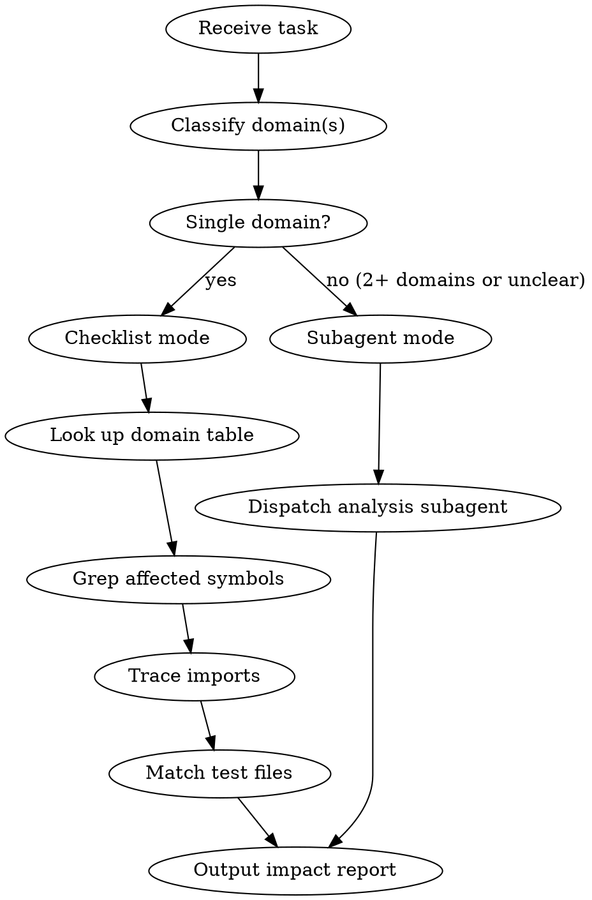

# Terrarium Analyze Skill — Implementation Plan

> **For agentic workers:** REQUIRED SUB-SKILL: Use superpowers:subagent-driven-development (recommended) or superpowers:executing-plans to implement this plan task-by-task. Steps use checkbox (`- [ ]`) syntax for tracking.

**Goal:** Create a project-local skill that provides Terrarium architecture map, task impact scoping, and subagent context templates.

**Architecture:** Single SKILL.md file in `.claude/skills/terrarium-analyze/`. Contains a frozen architecture map, domain classification table, adaptive analysis flow (checklist for single-domain, subagent for multi-domain), and ready-made subagent prompt templates. No scripts or supporting files needed.

**Tech Stack:** Skill documentation (Markdown with YAML frontmatter, Graphviz diagrams)

**Spec:** `docs/superpowers/specs/2026-04-12-terrarium-analyze-skill-design.md`

---

### Task 1: Create skill directory and SKILL.md skeleton

**Files:**
- Create: `.claude/skills/terrarium-analyze/SKILL.md`

- [ ] **Step 1: Create the skill directory**

Run: `mkdir -p .claude/skills/terrarium-analyze`

- [ ] **Step 2: Write SKILL.md with frontmatter, overview, and trigger conditions**

Create `.claude/skills/terrarium-analyze/SKILL.md` with:

```markdown
---
name: terrarium-analyze
description: Use when working on the Terrarium project and needing to scope task impact, identify affected files, or dispatch context-aware subagents — provides architecture map, domain classification, and subagent prompt templates
---

# Terrarium Analyze

## Overview

**Stop exploring from scratch.** This skill contains a frozen architecture map of the Terrarium project. Use it to classify tasks, scope impact, and dispatch context-aware subagents — all without re-reading the codebase every session.

Announce: "Using terrarium-analyze to scope task impact."

## When to Use

- Starting a new task on the Terrarium project and need to identify affected files
- About to dispatch subagents and need to provide Terrarium context
- Scoping a feature request or bug fix to understand blast radius

## When NOT to Use

- Working on a different project
- The task is trivial (single-file fix with obvious scope)
```

- [ ] **Step 3: Verify the file was created correctly**

Run: `head -20 .claude/skills/terrarium-analyze/SKILL.md`
Expected: YAML frontmatter with `name: terrarium-analyze` followed by the overview section

---

### Task 2: Add the architecture map

**Files:**
- Modify: `.claude/skills/terrarium-analyze/SKILL.md` (append after "When NOT to Use" section)

- [ ] **Step 1: Append the architecture map section to SKILL.md**

Append after the `## When NOT to Use` section:

```markdown

## Architecture Map

Frozen snapshot of the project structure. Update manually when significant structural changes occur (new top-level dirs, new plugin types, new stores).

```
src/lib/
├── types/              # Shared TypeScript types
│   ├── index.ts            # Re-exports
│   ├── character.ts        # Character, CharacterCard
│   ├── message.ts          # Message, MessageRole
│   ├── session.ts          # ChatSession
│   ├── scene.ts            # Scene
│   ├── lorebook.ts         # LorebookEntry, Lorebook
│   ├── persona.ts          # Persona
│   ├── prompt-preset.ts    # PromptPreset, PromptItem
│   ├── script.ts           # Script, ScriptBlock
│   ├── trigger.ts          # Trigger, TriggerAction
│   ├── plugin.ts           # Plugin interfaces
│   ├── config.ts           # AppSettings
│   ├── image-config.ts     # ImageGenConfig
│   └── art-style.ts        # ArtStyle
│
├── core/
│   ├── chat/               # Chat engine (SPQA pattern)
│   │   ├── engine.ts           # ChatEngine — main orchestrator
│   │   ├── pipeline.ts         # Prompt pipeline (assembly chain)
│   │   ├── prompt-assembler.ts # Resolves preset items → final prompt
│   │   ├── template-engine.ts # {{var}} resolution
│   │   ├── lorebook.ts        # Lorebook matching & injection
│   │   ├── regex.ts           # Regex scripting
│   │   └── use-chat.ts        # Reactive bridge: engine ↔ UI
│   │
│   ├── image/              # Image generation core
│   │   └── generator.ts       # ImageGenerator orchestrator
│   │
│   ├── image-gen/          # Image gen constants/helpers
│   │   └── novelai-constants.ts  # NovelAI-specific values
│   │
│   ├── presets/            # Default preset definitions
│   │   └── defaults.ts        # Built-in prompt presets
│   │
│   └── scripting/          # Lua scripting engine
│       ├── api.ts              # Script API surface
│       ├── bridge.ts           # Lua ↔ JS bridge
│       └── mutations.ts        # State mutation ops
│
├── plugins/
│   ├── providers/          # AI provider implementations
│   │   ├── builtin.ts          # Provider registry & base
│   │   ├── claude.ts           # Anthropic Claude
│   │   ├── openai-compatible.ts # OpenAI-compatible (OAI, DeepSeek, etc.)
│   │   └── sse.ts              # SSE stream parser
│   │
│   ├── card-formats/       # Character card parsers
│   │   ├── builtin.ts          # Card format registry
│   │   ├── risuai.ts           # RisuAI format
│   │   ├── sillytavern.ts      # SillyTavern (V2) format
│   │   └── generic-json.ts     # Generic JSON
│   │
│   ├── image-providers/    # Image gen backends
│   │   ├── builtin.ts          # Image provider registry
│   │   ├── novelai.ts          # NovelAI
│   │   └── comfyui.ts          # ComfyUI
│   │
│   └── prompt-builder/     # Prompt builder plugins
│       ├── builtin.ts          # Builder registry
│       └── default.ts          # Default builder
│
├── storage/               # Persistence layer
│   ├── database.ts            # IndexedDB wrapper
│   ├── characters.ts          # Character CRUD
│   ├── chats.ts               # Chat session CRUD
│   ├── personas.ts            # Persona CRUD
│   ├── settings.ts            # Settings read/write
│   └── paths.ts               # Storage path helpers
│
├── stores/                # Svelte reactive stores
│   ├── characters.ts          # Character store
│   ├── chat.ts                # Chat state store
│   ├── scene.ts               # Scene store
│   ├── settings.ts            # Settings store
│   └── theme.ts               # Theme store
│
├── components/
│   └── editors/           # Svelte editor components
│       ├── CharacterEditor.svelte
│       ├── LorebookEditor.svelte
│       ├── LorebookEntryForm.svelte
│       ├── PresetList.svelte
│       ├── PromptItemEditor.svelte
│       ├── RegexEditor.svelte
│       ├── ThemeRenderer.svelte
│       ├── TriggerEditor.svelte
│       ├── TriggerForm.svelte
│       └── VariableViewer.svelte

src/routes/                    # SvelteKit pages
├── +page.svelte               # Home
├── characters/                # Character list, new, edit
├── chat/[id]/                 # Chat view (+ info subpage)
└── settings/                  # Settings pages
    ├── image-generation/
    ├── personas/
    ├── prompt-builder/
    ├── providers/
    └── theme-editor/

src-tauri/src/                 # Rust backend
├── main.rs
├── lib.rs                     # Tauri commands
└── scripting.rs               # Lua scripting (Rust side)

tests/                         # Vitest test files (mirror src/ structure)
├── core/chat/                 # engine, lorebook, pipeline, prompt-assembler, regex, template-engine
├── core/image-gen/            # novelai-constants
├── core/image/                # generator
├── core/presets/              # defaults
├── core/scripting/            # bridge, mutations
├── core/                      # events, triggers, variables
├── plugins/card-formats/      # builtin, generic-json, risuai, sillytavern
├── plugins/image-providers/   # comfyui, novelai
├── plugins/prompt-builder/    # builtin, default
├── plugins/providers/         # builtin, claude, openai-compatible, sse
├── plugins/                   # registry
├── storage/                   # characters, chats, database, personas
└── stores/                    # characters-store, chat
```

## When to Update

Update the architecture map when:
- A new top-level directory is added under `src/lib/`
- A new plugin type is added
- A new storage file or store is created
- The test directory structure changes significantly

Do NOT update for:
- New files within existing directories
- New components within existing editor groups
- Minor refactors
```

- [ ] **Step 2: Verify the architecture map renders correctly**

Run: `grep -c "├──\|└──" .claude/skills/terrarium-analyze/SKILL.md`
Expected: 60+ matches (full tree rendered)

---

### Task 3: Add domain classification table and impact analysis flow

**Files:**
- Modify: `.claude/skills/terrarium-analyze/SKILL.md` (append after "When to Update" section)

- [ ] **Step 1: Append domain table and analysis flow**

Append after the `## When to Update` section:

```markdown

## Domain Classification

| Domain | Core path(s) | UI path(s) | Storage | Tests |
|--------|-------------|------------|---------|-------|
| Chat engine | `core/chat/engine.ts`, `core/chat/pipeline.ts`, `core/chat/use-chat.ts` | `routes/chat/` | `storage/chats.ts` | `tests/core/chat/` |
| Prompt/Preset | `core/chat/prompt-assembler.ts`, `core/chat/template-engine.ts` | `components/editors/PromptItemEditor.svelte`, `components/editors/PresetList.svelte` | `storage/settings.ts` | `tests/core/chat/prompt-assembler.test.ts`, `tests/core/chat/template-engine.test.ts` |
| Lorebook | `core/chat/lorebook.ts` | `components/editors/LorebookEditor.svelte` | — | `tests/core/chat/lorebook.test.ts` |
| Regex | `core/chat/regex.ts` | `components/editors/RegexEditor.svelte` | — | `tests/core/chat/regex.test.ts` |
| Plugins | `plugins/*/builtin.ts` | `settings/*/` | — | `tests/plugins/registry.test.ts` |
| Providers (AI) | `plugins/providers/` | `routes/settings/providers/` | `storage/settings.ts` | `tests/plugins/providers/` |
| Image gen | `core/image/generator.ts`, `core/image-gen/`, `plugins/image-providers/` | `routes/settings/image-generation/` | `storage/settings.ts` | `tests/core/image/`, `tests/plugins/image-providers/` |
| Cards | `plugins/card-formats/` | `components/editors/CharacterEditor.svelte` | `storage/characters.ts` | `tests/plugins/card-formats/` |
| Scripting | `core/scripting/`, `src-tauri/src/scripting.rs` | `components/editors/VariableViewer.svelte` | — | `tests/core/scripting/` |
| Persona | `types/persona.ts` | `routes/settings/personas/`, `components/editors/` | `storage/personas.ts` | `tests/storage/personas.test.ts` |
| Storage | `storage/*.ts` | — | (self) | `tests/storage/` |
| Stores | `stores/*.ts` | — | — | `tests/stores/` |
| Triggers | (in `core/`) | `components/editors/TriggerEditor.svelte` | — | `tests/core/triggers.test.ts` |
| Theme | — | `components/editors/ThemeRenderer.svelte` | `storage/settings.ts` | — |
| Tauri/Rust | `src-tauri/src/` | — | — | `src-tauri/tests/` |

## Impact Analysis



### Checklist Mode (single domain, ~70% of tasks)

1. **Classify** — Identify which single domain the task touches using the table above
2. **Lookup** — Get core/UI/storage/test paths from the domain table
3. **Grep** — Search for affected function names, class names, or type names within those paths
4. **Trace** — Check imports of files that reference changed symbols
5. **Tests** — List matching test files from the test column
6. **Output** — Produce the impact report below

### Subagent Mode (2+ domains or unclear scope)

Dispatch a general-purpose subagent with:
- The architecture map from this skill
- The domain classification table
- The task description
- Instructions to search across domains and trace cross-cutting dependencies

### Impact Report Format

Both modes produce:

```
Task: [description]
Domains: [list]

Must change:
  - path/to/file.ts — reason

Might change:
  - path/to/file.ts — reason

Tests to update:
  - tests/path/to/file.test.ts — reason

Risks:
  - [cross-cutting concerns]
```
```

- [ ] **Step 2: Verify the domain table is complete**

Run: `grep -c "^|" .claude/skills/terrarium-analyze/SKILL.md`
Expected: 17+ (header separator + 15 domains + header row)

---

### Task 4: Add subagent context templates

**Files:**
- Modify: `.claude/skills/terrarium-analyze/SKILL.md` (append after impact analysis section)

- [ ] **Step 1: Append subagent context templates section**

Append after the `### Impact Report Format` subsection:

```markdown

## Subagent Context Templates

When using superpowers:subagent-driven-development, use these templates to give subagents Terrarium context.

### Base Context Block

Always include this at the top of subagent prompts:

```
## Terrarium Project Context

You are working on Terrarium, a SvelteKit 5 + Tauri v2 desktop AI chatbot.

Tech stack:
- Frontend: SvelteKit 2, Svelte 5 ($props/$state runes), TypeScript 5 strict, Tailwind CSS v4 (Catppuccin Mocha)
- Backend: Tauri v2 (Rust), Lua scripting via mlua
- Build: Vite 6, Vitest 3 for testing

Critical conventions:
- Tauri HTTP plugin (@tauri-apps/plugin-http) for ALL streaming fetch — never browser fetch
- Svelte 5 runes ($state, $derived, $effect, $props) — never legacy Svelte 4 patterns ($:, .subscribe(), let: directives)
- Plugin-first architecture — providers, card formats, image providers, prompt builders are all plugins
- Test files mirror src/ structure under tests/
- Use vi.mock() for Tauri plugin dependencies in tests
```

### Domain Read Guides

Based on the task domain, tell the subagent to read these files first:

| Domain | Read first |
|--------|-----------|
| Chat engine | `src/lib/core/chat/engine.ts`, `src/lib/core/chat/pipeline.ts`, `src/lib/stores/chat.ts`, `src/lib/core/chat/use-chat.ts` |
| Prompt/Preset | `src/lib/core/chat/prompt-assembler.ts`, `src/lib/core/chat/template-engine.ts`, `src/lib/core/presets/defaults.ts` |
| Providers | `src/lib/plugins/providers/builtin.ts`, `src/lib/plugins/providers/sse.ts`, `src/lib/types/config.ts` |
| Image gen | `src/lib/core/image/generator.ts`, `src/lib/plugins/image-providers/builtin.ts`, `src/lib/core/image-gen/novelai-constants.ts` |
| Cards | `src/lib/plugins/card-formats/builtin.ts`, `src/lib/types/character.ts`, `src/lib/storage/characters.ts` |
| Scripting | `src/lib/core/scripting/api.ts`, `src/lib/core/scripting/bridge.ts`, `src-tauri/src/scripting.rs` |
| Storage | `src/lib/storage/database.ts`, `src/lib/storage/paths.ts` |
| Lorebook | `src/lib/core/chat/lorebook.ts`, `src/lib/types/lorebook.ts` |
| Persona | `src/lib/types/persona.ts`, `src/lib/storage/personas.ts` |

### Subagent Prompt Template

```
## Terrarium Project Context
[Insert Base Context Block above]

## Architecture
[Insert relevant section of the architecture map from this skill]

## Task: [task description from plan]

## Affected Files
[List from impact analysis report]

## Key Files to Read First
[From Domain Read Guide table above — pick the domain matching the task]

## Conventions
- Svelte 5 runes only ($state, $derived, $effect, $props)
- Streaming via @tauri-apps/plugin-http only
- Plugin registration pattern (see builtin.ts in each plugin dir)
- Test structure mirrors src/ under tests/
- vi.mock() for Tauri plugin dependencies

## Report Format
When done, report one of:
- DONE — task complete
- DONE_WITH_CONCERNS — complete but note concerns
- BLOCKED — cannot proceed, explain why
- NEEDS_CONTEXT — need clarification

Include:
- Files changed (list)
- Tests written/updated (list)
- Any concerns or blockers
```
```

- [ ] **Step 2: Verify the full SKILL.md file is well-formed**

Run: `wc -l .claude/skills/terrarium-analyze/SKILL.md`
Expected: ~250-300 lines

---

### Task 5: Commit and verify skill discovery

**Files:**
- Verify: `.claude/skills/terrarium-analyze/SKILL.md`

- [ ] **Step 1: Review the complete SKILL.md for consistency**

Read the full file and verify:
- YAML frontmatter has `name` and `description` fields
- All sections flow logically: overview → map → domain table → analysis flow → subagent templates
- No placeholder text (no TBD, TODO, "fill in later")
- Domain table paths match the architecture map
- File paths in read guides use correct `src/lib/` prefix

- [ ] **Step 2: Commit the skill**

```bash
git add .claude/skills/terrarium-analyze/SKILL.md
git commit -m "feat: add terrarium-analyze skill for project-aware analysis and subagent context"
```

- [ ] **Step 3: Verify skill is discoverable**

Run: `grep -r "terrarium-analyze" .claude/skills/ --include="*.md" -l`
Expected: `.claude/skills/terrarium-analyze/SKILL.md`

---

## Self-Review

### Spec Coverage

| Spec Section | Covered by Task |
|-------------|----------------|
| Frontmatter | Task 1 Step 2 |
| Overview | Task 1 Step 2 |
| Architecture Map (static) | Task 2 Step 1 |
| Domain Classification Table | Task 3 Step 1 |
| Impact Analysis Flow | Task 3 Step 1 |
| Subagent Context Templates | Task 4 Step 1 |
| When to Update | Task 2 Step 1 |
| Maintenance notes | Task 2 Step 1 (included in update section) |

All spec sections covered. No gaps.

### Placeholder Scan

No TBD, TODO, or "fill in later" patterns. All code blocks contain complete content.

### Type Consistency

All file paths in the domain table match the architecture map. All read guide paths include the correct `src/lib/` prefix. No naming mismatches.
