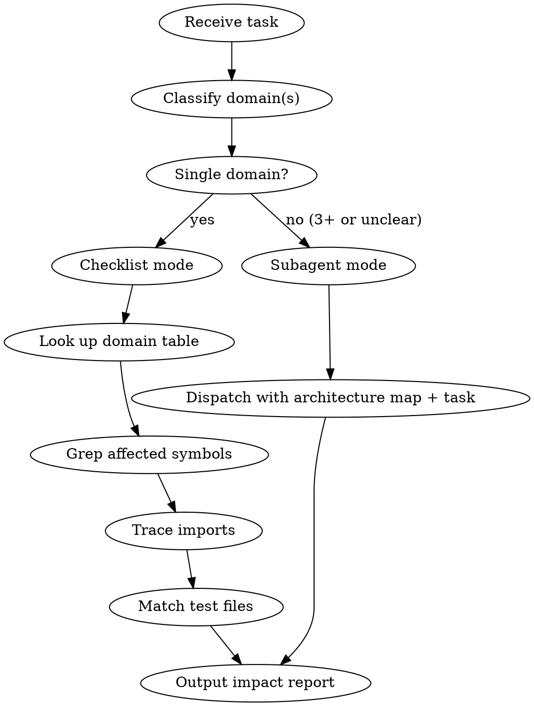

# Terrarium Analyze Skill — Design Spec

**Date:** 2026-04-12
**Status:** Draft
**Location:** `.claude/skills/terrarium-analyze/SKILL.md`

## Goal

One project-local skill that (1) accelerates task scoping and impact analysis, and (2) provides Terrarium-aware context templates for subagent dispatch via `superpowers:subagent-driven-development`.

## Design Decisions

| Decision | Choice | Rationale |
|----------|--------|-----------|
| Location | `.claude/skills/` (project-local) | Both skills are Terrarium-specific |
| One or two skills | One combined skill | Analysis and subagent context share the same architecture map |
| Context packaging | Static map + dynamic read guide | Low maintenance, still accurate |
| Analysis flow | Adaptive (checklist for single-domain, subagent for multi-domain) | Handles ~70% of tasks fast, escalates for complex ones |

---

## Skill Structure

```
.claude/skills/terrarium-analyze/
  SKILL.md          # Full skill document
```

---

## SKILL.md Sections

### 1. Frontmatter

```yaml
---
name: terrarium-analyze
description: Use when working on the Terrarium project — provides architecture map, task impact scoping, and subagent context templates for efficient analysis and subagent dispatch
---
```

### 2. Overview

Core principle: **Stop exploring from scratch.** This skill contains a frozen architecture map of the Terrarium project. Use it to classify tasks, scope impact, and dispatch context-aware subagents — all without re-reading the codebase every session.

### 3. Architecture Map (Static)

The frozen map of the project. Updated manually when significant structural changes occur.

```
src/lib/
├── types/              # Shared TypeScript types
│   ├── index.ts            # Re-exports
│   ├── character.ts        # Character, CharacterCard
│   ├── message.ts          # Message, MessageRole
│   ├── session.ts          # ChatSession
│   ├── scene.ts            # Scene
│   ├── lorebook.ts         # LorebookEntry, Lorebook
│   ├── persona.ts          # Persona
│   ├── prompt-preset.ts    # PromptPreset, PromptItem
│   ├── script.ts           # Script, ScriptBlock
│   ├── trigger.ts          # Trigger, TriggerAction
│   ├── plugin.ts           # Plugin interfaces
│   ├── config.ts           # AppSettings
│   ├── image-config.ts     # ImageGenConfig
│   └── art-style.ts        # ArtStyle
│
├── core/
│   ├── chat/               # Chat engine (SPQA pattern)
│   │   ├── engine.ts           # ChatEngine — main orchestrator
│   │   ├── pipeline.ts         # Prompt pipeline (assembly chain)
│   │   ├── prompt-assembler.ts # Resolves preset items → final prompt
│   │   ├── template-engine.ts # {{var}} resolution
│   │   ├── lorebook.ts        # Lorebook matching & injection
│   │   ├── regex.ts           # Regex scripting
│   │   └── use-chat.ts        # Reactive bridge: engine ↔ UI
│   │
│   ├── image/              # Image generation core
│   │   └── generator.ts       # ImageGenerator orchestrator
│   │
│   ├── image-gen/          # Image gen constants/helpers
│   │   └── novelai-constants.ts  # NovelAI-specific values
│   │
│   ├── presets/            # Default preset definitions
│   │   └── defaults.ts        # Built-in prompt presets
│   │
│   └── scripting/          # Lua scripting engine
│       ├── api.ts              # Script API surface
│       ├── bridge.ts           # Lua ↔ JS bridge
│       └── mutations.ts        # State mutation ops
│
├── plugins/
│   ├── providers/          # AI provider implementations
│   │   ├── builtin.ts          # Provider registry & base
│   │   ├── claude.ts           # Anthropic Claude
│   │   ├── openai-compatible.ts # OpenAI-compatible (OAI, DeepSeek, etc.)
│   │   └── sse.ts              # SSE stream parser
│   │
│   ├── card-formats/       # Character card parsers
│   │   ├── builtin.ts          # Card format registry
│   │   ├── risuai.ts           # RisuAI format
│   │   ├── sillytavern.ts      # SillyTavern (V2) format
│   │   └── generic-json.ts     # Generic JSON
│   │
│   ├── image-providers/    # Image gen backends
│   │   ├── builtin.ts          # Image provider registry
│   │   ├── novelai.ts          # NovelAI
│   │   └── comfyui.ts          # ComfyUI
│   │
│   └── prompt-builder/     # Prompt builder plugins
│       ├── builtin.ts          # Builder registry
│       └── default.ts          # Default builder
│
├── storage/               # Persistence layer
│   ├── database.ts            # IndexedDB wrapper
│   ├── characters.ts          # Character CRUD
│   ├── chats.ts               # Chat session CRUD
│   ├── personas.ts            # Persona CRUD
│   ├── settings.ts            # Settings read/write
│   └── paths.ts               # Storage path helpers
│
├── stores/                # Svelte reactive stores
│   ├── characters.ts          # Character store
│   ├── chat.ts                # Chat state store
│   ├── scene.ts               # Scene store
│   ├── settings.ts            # Settings store
│   └── theme.ts               # Theme store
│
├── components/
│   └── editors/           # Svelte editor components
│       ├── CharacterEditor.svelte
│       ├── LorebookEditor.svelte
│       ├── LorebookEntryForm.svelte
│       ├── PresetList.svelte
│       ├── PromptItemEditor.svelte
│       ├── RegexEditor.svelte
│       ├── ThemeRenderer.svelte
│       ├── TriggerEditor.svelte
│       ├── TriggerForm.svelte
│       └── VariableViewer.svelte
│
src/routes/                    # SvelteKit pages
├── +page.svelte               # Home
├── characters/                # Character list, new, edit
├── chat/[id]/                 # Chat view (+ info subpage)
└── settings/                  # Settings pages
    ├── image-generation/
    ├── personas/
    ├── prompt-builder/
    ├── providers/
    └── theme-editor/

src-tauri/src/                 # Rust backend
├── main.rs
├── lib.rs                     # Tauri commands
└── scripting.rs               # Lua scripting (Rust side)

tests/                         # Vitest test files (mirror src/ structure)
├── core/chat/                 # engine, lorebook, pipeline, prompt-assembler, regex, template-engine
├── core/image-gen/            # novelai-constants
├── core/image/                # generator
├── core/presets/              # defaults
├── core/scripting/            # bridge, mutations
├── core/                      # events, triggers, variables
├── plugins/card-formats/      # builtin, generic-json, risuai, sillytavern
├── plugins/image-providers/   # comfyui, novelai
├── plugins/prompt-builder/    # builtin, default
├── plugins/providers/         # builtin, claude, openai-compatible, sse
├── plugins/                   # registry
├── storage/                   # characters, chats, database, personas
└── stores/                    # characters-store, chat
```

### 4. Domain Classification Table

| Domain | Core path(s) | UI path(s) | Storage | Tests |
|--------|-------------|------------|---------|-------|
| Chat engine | `core/chat/engine.ts`, `core/chat/pipeline.ts`, `core/chat/use-chat.ts` | `routes/chat/` | `storage/chats.ts` | `tests/core/chat/` |
| Prompt/Preset | `core/chat/prompt-assembler.ts`, `core/chat/template-engine.ts` | `components/editors/PromptItemEditor.svelte`, `components/editors/PresetList.svelte` | `storage/settings.ts` | `tests/core/chat/prompt-assembler.test.ts`, `tests/core/chat/template-engine.test.ts` |
| Lorebook | `core/chat/lorebook.ts` | `components/editors/LorebookEditor.svelte` | — | `tests/core/chat/lorebook.test.ts` |
| Regex | `core/chat/regex.ts` | `components/editors/RegexEditor.svelte` | — | `tests/core/chat/regex.test.ts` |
| Plugins | `plugins/*/builtin.ts` | `settings/*/` | — | `tests/plugins/registry.test.ts` |
| Providers (AI) | `plugins/providers/` | `routes/settings/providers/` | `storage/settings.ts` | `tests/plugins/providers/` |
| Image gen | `core/image/generator.ts`, `core/image-gen/`, `plugins/image-providers/` | `components/illust/*`, `routes/settings/image-generation/` | `storage/settings.ts` | `tests/core/image/`, `tests/plugins/image-providers/` |
| Cards | `plugins/card-formats/` | `components/editors/CharacterEditor.svelte` | `storage/characters.ts` | `tests/plugins/card-formats/` |
| Scripting | `core/scripting/`, `src-tauri/src/scripting.rs` | `components/editors/VariableViewer.svelte` | — | `tests/core/scripting/` |
| Persona | `types/persona.ts` | `routes/settings/personas/`, `components/editors/` | `storage/personas.ts` | `tests/storage/personas.test.ts` |
| Storage | `storage/*.ts` | — | (self) | `tests/storage/` |
| Stores | `stores/*.ts` | — | — | `tests/stores/` |
| Triggers | `core/triggers.ts` | `components/editors/TriggerEditor.svelte` | — | `tests/core/triggers.test.ts` |
| Theme | — | `components/editors/ThemeRenderer.svelte` | `storage/settings.ts` | — |
| Tauri/Rust | `src-tauri/src/` | — | — | `src-tauri/tests/` |

### 5. Impact Analysis Flow



#### Checklist Mode (single domain, ~70% of tasks)

1. **Classify** — Identify which single domain the task touches
2. **Lookup** — Use the domain table to get core/UI/storage/test paths
3. **Grep** — Search for affected function names, class names, or type names within those paths
4. **Trace** — Check imports of files that reference changed symbols
5. **Tests** — List matching test files from the test column
6. **Output** — Affected files list with categorization (must-change / might-change / test-to-update)

#### Subagent Mode (multi-domain or unclear scope)

Dispatch a general-purpose subagent with:
- The full architecture map from this skill
- The task description
- Instructions to search across domains and trace cross-cutting dependencies

The subagent returns a structured impact report.

#### Impact Report Format

Both modes produce the same output:

```
Task: [description]
Domains: [chat-engine, providers, ...]

Must change:
  - path/to/file.ts — [reason]

Might change:
  - path/to/file.ts — [reason]

Tests to update:
  - tests/path/to/file.test.ts — [reason]

Risks:
  - [any cross-cutting concerns]
```

### 6. Subagent Context Templates

Ready-made context blocks to prepend to subagent prompts when using `superpowers:subagent-driven-development`.

#### Base Context (always include)

```
## Terrarium Project Context

You are working on Terrarium, a SvelteKit 5 + Tauri v2 desktop AI chatbot.

Tech stack:
- Frontend: SvelteKit 2, Svelte 5 ($props/$state runes), TypeScript 5 strict, Tailwind CSS v4 (Catppuccin Mocha)
- Backend: Tauri v2 (Rust), Lua scripting via mlua
- Build: Vite 6, Vitest 3 for testing
- Key: Tauri HTTP plugin (@tauri-apps/plugin-http) for all streaming fetch (NOT browser fetch)
- Key: Svelte 5 runes ($state, $derived, $effect, $props) — no legacy Svelte 4 patterns
- Key: Plugin-first architecture — providers, card formats, image providers, prompt builders are all plugins

Architecture: [architecture map from Section 3]

Before coding, read these files first to understand current state:
- [domain-specific files from the domain table]
```

#### Domain-Specific Read Guides

For each domain, a list of files the subagent should read first:

| Domain | Read first |
|--------|-----------|
| Chat engine | `core/chat/engine.ts`, `core/chat/pipeline.ts`, `stores/chat.ts`, `core/chat/use-chat.ts` |
| Prompt/Preset | `core/chat/prompt-assembler.ts`, `core/chat/template-engine.ts`, `core/presets/defaults.ts` |
| Providers | `plugins/providers/builtin.ts`, `plugins/providers/sse.ts`, `types/config.ts` |
| Image gen | `core/image/generator.ts`, `plugins/image-providers/builtin.ts`, `core/image-gen/novelai-constants.ts` |
| Cards | `plugins/card-formats/builtin.ts`, `types/character.ts`, `storage/characters.ts` |
| Scripting | `core/scripting/api.ts`, `core/scripting/bridge.ts`, `src-tauri/src/scripting.rs` |
| Storage | `storage/database.ts`, `storage/paths.ts` |
| Lorebook | `core/chat/lorebook.ts`, `types/lorebook.ts` |
| Persona | `types/persona.ts`, `storage/personas.ts` |

#### Subagent Prompt Template

When dispatching subagents for implementation tasks, use this template structure:

```
[Base Context from above]

## Task: [task description from plan]

## Affected files (from impact analysis)
[list from impact report]

## Key files to read
[domain-specific read list]

## Conventions
- Use Svelte 5 runes ($state, $derived, $effect, $props) — never legacy .subscribe() or let: directives
- Streaming requests go through @tauri-apps/plugin-http — never browser fetch
- All providers/plugins follow the plugin registration pattern (see builtin.ts in each plugin dir)
- Test files mirror src/ structure under tests/
- Use vi.mock() for Tauri plugin dependencies in tests

## Report format
When done, report:
- DONE / DONE_WITH_CONCERNS / BLOCKED / NEEDS_CONTEXT
- Files changed (list)
- Tests written/updated (list)
- Any concerns or blockers
```

### 7. When to Update This Skill

Update the architecture map when:
- A new top-level directory is added under `src/lib/`
- A new plugin type is added
- The test directory structure changes significantly
- A new storage file or store is created

Do NOT update for:
- New files within existing directories
- New components within existing editor groups
- Minor refactors

---

## Maintenance

- **Architecture map:** Update manually on structural changes (new dirs, new plugin types)
- **Domain table:** Update when new domains emerge or paths change
- **Templates:** Update when conventions change (e.g., switching from Tauri HTTP to something else)
- **Review cadence:** Check after every 5th plan completion, or when `git log` shows structural changes

## Integration with Superpowers

This skill integrates with the superpowers system as follows:

1. **Before brainstorming/writing-plans:** Use the impact analysis flow to scope the task
2. **During subagent-driven-development:** Use the subagent context templates to dispatch informed subagents
3. **During code review:** Use the domain table to verify test coverage

The skill does NOT replace any superpowers skill — it provides Terrarium-specific context that makes the existing superpowers workflow faster and more accurate.
